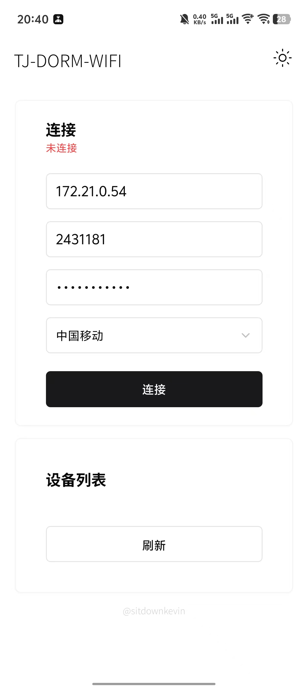
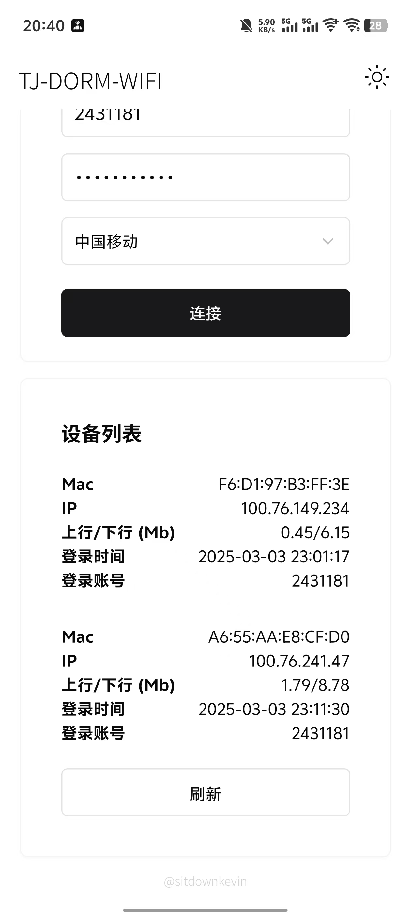

# DORM WIFI

- `TJ-DORM-WIFI` connector based on React-Native.

- Test on [Tianjiao Apartment](https://news.tongji.edu.cn/info/1002/88212.htm).

- **Download links**

    - Android - [APK](https://github.com/sitdownkevin/dorm-wifi-react-native/releases/download/v1.0.0/build-1740468692243.apk)
    - iOS - (Build from source)

- The desktop (macOS/Windows) version is [here](https://github.com/sitdownkevin/dorm-wifi-tauri).

## Features

### (Dis)connect to `TJ-DORM-WIFI`



### Get device information by account

Query all device information under the current account




## Dev

```shell
yarn
```

```shell
yarn install
```

```shell
yarn android
```

## Build

```shell
npx expo prebuild
```

```shell
yarn build
```